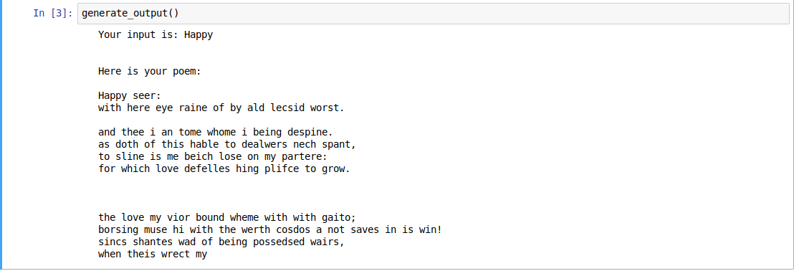

# Poem-Maker

This is a program that returns a poem for whatever first word you enter in Shakespearean style. Here, LSTMs(2-layered) instead of the basic RNN to capture longer-range dependencies.

## Dependancies

You will need the following python packkages:

* `keras`
* `jupyter notebook`

Other dependancies (functions) are defined in the other file(s) in this repository.

## Running the tests

You will need to fork and clone my repository and install the above dependancies to get started.
Run the [poem.ipynb](poem.ipynb) file in your jupyter notebook and get started.:)

### My example

## Acknowledgments

* Coursera- Deep Learning specilization courses, Deeplearning.ai by Andrew Ng.
